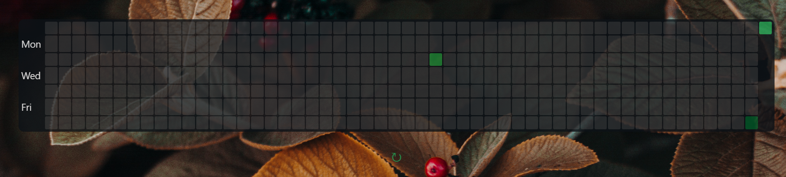

# Commit-tracker-wallpaper-engine

Shows github commit graph using plain html, css and javascript

I am currently using it alongside wallpaper engine to display as a desktop wallpaper on windows.

# Steps to get this working for your profile:
- change the userName and token consts in javascripts to your github username and your github token (follow https://docs.github.com/en/authentication/keeping-your-account-and-data-secure/creating-a-personal-access-token to create a token if you do not have one)
- optionally add an img/bg.jpg to set as html backgroundimg

## How it looks:
;

image credits: [!Irinia Iriser](https://www.pexels.com/@iriser/)